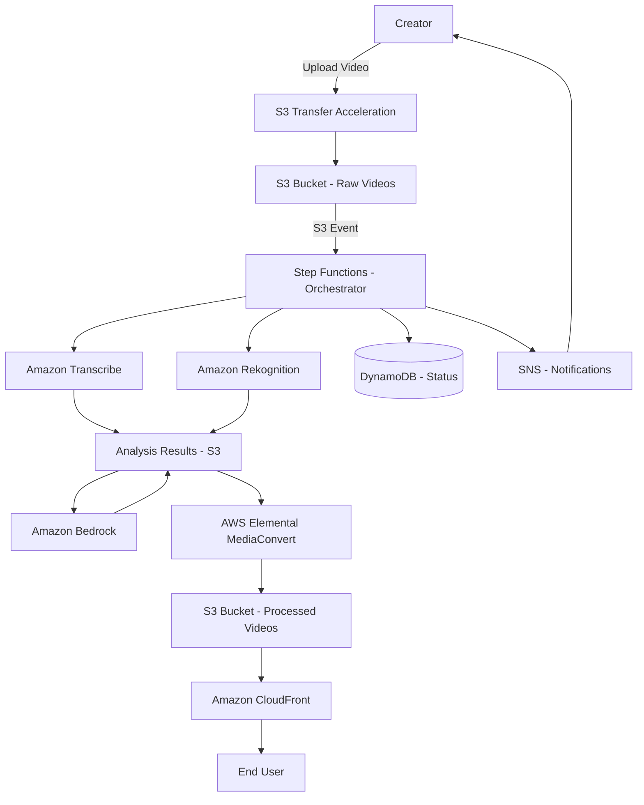
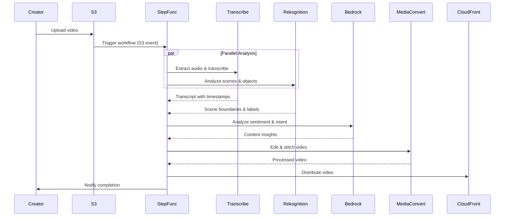

# Design Document: Video Processing Pipeline

## Overview

The Video Processing Pipeline is a serverless, event-driven system built on AWS that automates video content processing from upload through delivery. The architecture uses S3 events to trigger processing stages, AWS Step Functions to orchestrate the workflow, and managed AI services (Transcribe, Rekognition, Bedrock) for content analysis. The system is designed for horizontal scalability, fault tolerance, and cost efficiency through pay-per-use pricing.

The pipeline follows a four-layer architecture:
1. **Ingestion Layer**: Handles secure uploads and storage
2. **Analysis Layer**: Extracts content insights using AI services
3. **Execution Layer**: Performs automated editing operations
4. **Delivery Layer**: Distributes processed content globally

## Architecture

### High-Level Architecture Diagram



### Event-Driven Workflow



## Components and Interfaces

### 1. Ingestion Layer

**Components:**
- **S3 Raw Video Bucket**: Stores uploaded videos with versioning enabled
- **S3 Transfer Acceleration**: Optimizes upload speed for large files
- **Lambda Upload Handler**: Validates uploads and initializes processing

**Interfaces:**

```
Interface: VideoUploadAPI
  POST /upload
    Input: 
      - video_file: Binary
      - creator_id: String
      - metadata: Object {title, description, music_preference}
    Output:
      - video_id: UUID
      - upload_url: String (presigned S3 URL)
      - status: String
    Errors:
      - InvalidFileFormat: Video format not supported
      - FileTooLarge: Video exceeds size limit
      - AuthenticationError: Invalid creator credentials

Interface: S3EventTrigger
  Event: s3:ObjectCreated:*
    Payload:
      - bucket: String
      - key: String (S3 object key)
      - size: Integer
      - etag: String
    Triggers: Step Functions workflow execution
```

**Security:**
- S3 bucket encryption at rest (AES-256)
- Presigned URLs with 1-hour expiration for uploads
- IAM roles with least-privilege access
- S3 bucket policies restricting public access

### 2. Analysis Layer

**Components:**
- **Transcription Service**: Wrapper around Amazon Transcribe
- **Scene Detection Service**: Wrapper around Amazon Rekognition Video
- **Intent Analysis Service**: Wrapper around Amazon Bedrock (Claude model)
- **Analysis Results Store**: S3 bucket for structured analysis outputs

**Interfaces:**

```
Interface: TranscriptionService
  Method: transcribe_audio(video_id: UUID, s3_uri: String) -> TranscriptionJob
    Returns: job_id for async processing
  
  Method: get_transcript(job_id: String) -> Transcript
    Output:
      - segments: List[TranscriptSegment]
        - text: String
        - start_time: Float (seconds)
        - end_time: Float (seconds)
        - speaker_label: String (optional)
      - confidence: Float

Interface: SceneDetectionService
  Method: detect_scenes(video_id: UUID, s3_uri: String) -> DetectionJob
    Returns: job_id for async processing
  
  Method: get_scene_analysis(job_id: String) -> SceneAnalysis
    Output:
      - scene_boundaries: List[SceneBoundary]
        - timestamp: Float (seconds)
        - confidence: Float
      - detected_labels: List[Label]
        - name: String
        - confidence: Float
        - timestamp: Float
        - bounding_box: Object (optional)
      - faces: List[Face]
        - timestamp: Float
        - confidence: Float
        - emotions: List[String]

Interface: IntentAnalysisService
  Method: analyze_content(video_id: UUID, transcript: Transcript, scenes: SceneAnalysis) -> ContentInsights
    Output:
      - sentiment: String (positive, negative, neutral, humorous, serious)
      - sentiment_confidence: Float
      - intent: String (educational, entertainment, promotional, storytelling)
      - intent_confidence: Float
      - key_moments: List[Moment]
        - timestamp: Float
        - description: String
        - importance: Float
      - editing_suggestions: Object
        - preserve_pauses: List[TimeRange]
        - emphasis_points: List[Float]
```

**Analysis Workflow:**
1. Transcription and scene detection run in parallel (no dependencies)
2. Results stored in S3 as JSON with video_id as key
3. Intent analysis runs after both complete, combining insights
4. All results passed to Execution Layer for editing decisions

### 3. Execution Layer

**Components:**
- **Dead Air Detector**: Identifies silence segments from transcript
- **Edit Decision Generator**: Creates editing instructions from analysis
- **MediaConvert Job Manager**: Orchestrates video editing operations
- **Audio Processor**: Handles music overlay and ducking

**Interfaces:**

```
Interface: DeadAirDetector
  Method: detect_dead_air(transcript: Transcript, insights: ContentInsights) -> List[DeadAirSegment]
    Output:
      - segments: List[DeadAirSegment]
        - start_time: Float
        - end_time: Float
        - duration: Float
        - should_remove: Boolean (false if intentional pause)

Interface: EditDecisionGenerator
  Method: generate_edit_list(
    video_id: UUID,
    dead_air: List[DeadAirSegment],
    scenes: SceneAnalysis,
    insights: ContentInsights,
    music_preference: Object
  ) -> EditDecisionList
    Output:
      - cuts: List[Cut]
        - start_time: Float
        - end_time: Float
        - action: String (remove, keep, fade)
      - music_overlay: MusicConfig
        - track_uri: String
        - start_time: Float
        - volume_curve: List[VolumePoint]
          - timestamp: Float
          - volume: Float (0.0 to 1.0)
      - transitions: List[Transition]
        - timestamp: Float
        - type: String (cut, crossfade, fade_to_black)
        - duration: Float

Interface: MediaConvertJobManager
  Method: create_edit_job(
    video_id: UUID,
    source_s3_uri: String,
    edit_list: EditDecisionList,
    output_formats: List[String]
  ) -> MediaConvertJob
    Returns: job_id for async processing
  
  Method: get_job_status(job_id: String) -> JobStatus
    Output:
      - status: String (submitted, progressing, complete, error)
      - progress_percent: Integer
      - output_uris: List[String] (S3 URIs of processed videos)
      - error_message: String (if status is error)
```

**Editing Logic:**

Dead Air Removal Algorithm:
```
for each transcript_segment in transcript:
  if segment.end_time - segment.start_time > 2.0 seconds:
    if not is_intentional_pause(segment, insights):
      mark_for_removal(segment)
  
  if next_segment exists:
    gap = next_segment.start_time - segment.end_time
    if gap > 2.0 seconds:
      if not is_intentional_pause_between(segment, next_segment, insights):
        mark_for_removal(TimeRange(segment.end_time, next_segment.start_time))

def is_intentional_pause(segment, insights):
  # Check if pause occurs during dramatic moments or emphasis points
  for emphasis in insights.editing_suggestions.emphasis_points:
    if abs(emphasis - segment.start_time) < 1.0:
      return True
  return False
```

Music Synchronization Algorithm:
```
def generate_music_volume_curve(scenes, transcript, music_duration):
  volume_curve = []
  
  for timestamp in range(0, video_duration, 0.5):  # Sample every 0.5 seconds
    # Default music volume
    volume = 0.3
    
    # Duck music during speech
    if is_speech_active(timestamp, transcript):
      volume = 0.15  # Lower volume during speech
    
    # Boost music during scene transitions
    if is_near_scene_boundary(timestamp, scenes):
      if not is_speech_active(timestamp, transcript):
        volume = 0.5
    
    volume_curve.append(VolumePoint(timestamp, volume))
  
  # Fade out at end
  fade_start = video_duration - 3.0
  for point in volume_curve:
    if point.timestamp > fade_start:
      fade_progress = (point.timestamp - fade_start) / 3.0
      point.volume *= (1.0 - fade_progress)
  
  return volume_curve
```

### 4. Delivery Layer

**Components:**
- **Processed Video Store**: S3 bucket for edited videos
- **CloudFront Distribution**: CDN for global content delivery
- **Streaming Configuration**: Adaptive bitrate streaming setup

**Interfaces:**

```
Interface: VideoDeliveryAPI
  GET /video/{video_id}/preview
    Output:
      - video_url: String (CloudFront URL)
      - formats: List[Format]
        - resolution: String (1080p, 720p, 480p)
        - url: String
        - bitrate: Integer
      - thumbnail_url: String
      - duration: Float
    Errors:
      - VideoNotReady: Processing not complete
      - VideoNotFound: Invalid video_id
      - AccessDenied: User not authorized

  GET /video/{video_id}/status
    Output:
      - status: String (uploading, analyzing, editing, delivering, ready, failed)
      - progress_percent: Integer
      - current_stage: String
      - estimated_completion: ISO8601 timestamp
      - error_details: String (if failed)
```

**CloudFront Configuration:**
- Origin: S3 processed video bucket
- Cache behavior: Cache based on query strings for format selection
- Signed URLs for access control (optional)
- Geo-restriction: Configurable per creator
- Custom error pages for processing states

### 5. Orchestration Layer

**Components:**
- **Step Functions State Machine**: Coordinates entire workflow
- **DynamoDB Status Table**: Tracks processing state
- **SNS Topics**: Sends notifications to creators
- **CloudWatch Logs**: Centralized logging

**Step Functions State Machine:**

```json
{
  "Comment": "Video Processing Pipeline",
  "StartAt": "ValidateUpload",
  "States": {
    "ValidateUpload": {
      "Type": "Task",
      "Resource": "arn:aws:lambda:REGION:ACCOUNT:function:ValidateUpload",
      "Next": "ParallelAnalysis",
      "Catch": [{
        "ErrorEquals": ["States.ALL"],
        "Next": "NotifyFailure"
      }]
    },
    "ParallelAnalysis": {
      "Type": "Parallel",
      "Branches": [
        {
          "StartAt": "StartTranscription",
          "States": {
            "StartTranscription": {
              "Type": "Task",
              "Resource": "arn:aws:lambda:REGION:ACCOUNT:function:StartTranscription",
              "Next": "WaitForTranscription"
            },
            "WaitForTranscription": {
              "Type": "Task",
              "Resource": "arn:aws:states:::lambda:invoke.waitForTaskToken",
              "Next": "TranscriptionComplete"
            },
            "TranscriptionComplete": {
              "Type": "Pass",
              "End": true
            }
          }
        },
        {
          "StartAt": "StartSceneDetection",
          "States": {
            "StartSceneDetection": {
              "Type": "Task",
              "Resource": "arn:aws:lambda:REGION:ACCOUNT:function:StartSceneDetection",
              "Next": "WaitForSceneDetection"
            },
            "WaitForSceneDetection": {
              "Type": "Task",
              "Resource": "arn:aws:states:::lambda:invoke.waitForTaskToken",
              "Next": "SceneDetectionComplete"
            },
            "SceneDetectionComplete": {
              "Type": "Pass",
              "End": true
            }
          }
        }
      ],
      "Next": "AnalyzeIntent"
    },
    "AnalyzeIntent": {
      "Type": "Task",
      "Resource": "arn:aws:lambda:REGION:ACCOUNT:function:AnalyzeIntent",
      "Next": "GenerateEditDecisions"
    },
    "GenerateEditDecisions": {
      "Type": "Task",
      "Resource": "arn:aws:lambda:REGION:ACCOUNT:function:GenerateEditDecisions",
      "Next": "StartMediaConvert"
    },
    "StartMediaConvert": {
      "Type": "Task",
      "Resource": "arn:aws:lambda:REGION:ACCOUNT:function:StartMediaConvert",
      "Next": "WaitForMediaConvert"
    },
    "WaitForMediaConvert": {
      "Type": "Task",
      "Resource": "arn:aws:states:::lambda:invoke.waitForTaskToken",
      "Next": "DistributeToCloudFront"
    },
    "DistributeToCloudFront": {
      "Type": "Task",
      "Resource": "arn:aws:lambda:REGION:ACCOUNT:function:DistributeToCloudFront",
      "Next": "NotifySuccess"
    },
    "NotifySuccess": {
      "Type": "Task",
      "Resource": "arn:aws:lambda:REGION:ACCOUNT:function:NotifyCreator",
      "End": true
    },
    "NotifyFailure": {
      "Type": "Task",
      "Resource": "arn:aws:lambda:REGION:ACCOUNT:function:NotifyCreator",
      "End": true
    }
  }
}
```

**DynamoDB Status Table Schema:**

```
Table: VideoProcessingStatus
  Partition Key: video_id (String)
  Sort Key: timestamp (Number)
  
  Attributes:
    - video_id: UUID
    - creator_id: String
    - status: String (uploading, analyzing, editing, delivering, ready, failed)
    - current_stage: String
    - progress_percent: Integer
    - source_s3_uri: String
    - processed_s3_uris: Map<String, String> (format -> URI)
    - analysis_results_uri: String
    - error_message: String (optional)
    - created_at: ISO8601 timestamp
    - updated_at: ISO8601 timestamp
    - estimated_completion: ISO8601 timestamp
    - processing_metrics: Object
      - transcription_duration: Float
      - scene_detection_duration: Float
      - intent_analysis_duration: Float
      - editing_duration: Float
      - total_duration: Float
  
  GSI: CreatorIndex
    Partition Key: creator_id
    Sort Key: created_at
```

## Data Models

### Video Asset

```
VideoAsset:
  video_id: UUID
  creator_id: String
  title: String
  description: String
  source_s3_uri: String
  file_size: Integer (bytes)
  duration: Float (seconds)
  format: String (mp4, mov, avi)
  resolution: String (1920x1080, etc.)
  uploaded_at: ISO8601 timestamp
  metadata: Object
    - music_preference: Object
      - track_id: String (optional)
      - genre: String (optional)
      - mood: String (optional)
    - custom_fields: Map<String, String>
```

### Transcript

```
Transcript:
  video_id: UUID
  language_code: String
  segments: List[TranscriptSegment]
  speakers: List[Speaker]
  confidence: Float
  generated_at: ISO8601 timestamp

TranscriptSegment:
  text: String
  start_time: Float (seconds)
  end_time: Float (seconds)
  confidence: Float
  speaker_label: String (optional)
  alternatives: List[String] (optional)

Speaker:
  label: String
  total_speech_time: Float (seconds)
```

### Scene Analysis

```
SceneAnalysis:
  video_id: UUID
  scene_boundaries: List[SceneBoundary]
  detected_labels: List[Label]
  faces: List[Face]
  technical_cues: List[TechnicalCue]
  generated_at: ISO8601 timestamp

SceneBoundary:
  timestamp: Float (seconds)
  confidence: Float
  scene_type: String (shot_change, fade, dissolve)

Label:
  name: String
  confidence: Float
  timestamp: Float (seconds)
  duration: Float (seconds)
  bounding_box: BoundingBox (optional)
  parent_labels: List[String]

Face:
  face_id: String
  timestamp: Float (seconds)
  confidence: Float
  bounding_box: BoundingBox
  emotions: List[Emotion]
  age_range: Object {low: Integer, high: Integer}

BoundingBox:
  left: Float (0.0 to 1.0, normalized)
  top: Float
  width: Float
  height: Float

Emotion:
  type: String (HAPPY, SAD, ANGRY, SURPRISED, etc.)
  confidence: Float

TechnicalCue:
  type: String (black_frame, color_bars, end_credits)
  timestamp: Float (seconds)
  confidence: Float
```

### Content Insights

```
ContentInsights:
  video_id: UUID
  sentiment: String (positive, negative, neutral, humorous, serious)
  sentiment_confidence: Float
  intent: String (educational, entertainment, promotional, storytelling)
  intent_confidence: Float
  key_moments: List[Moment]
  editing_suggestions: EditingSuggestions
  generated_at: ISO8601 timestamp

Moment:
  timestamp: Float (seconds)
  description: String
  importance: Float (0.0 to 1.0)
  moment_type: String (climax, introduction, conclusion, transition)

EditingSuggestions:
  preserve_pauses: List[TimeRange]
  emphasis_points: List[Float] (timestamps)
  recommended_cuts: List[TimeRange]
  pacing_notes: String

TimeRange:
  start_time: Float (seconds)
  end_time: Float (seconds)
```

### Edit Decision List

```
EditDecisionList:
  video_id: UUID
  cuts: List[Cut]
  music_overlay: MusicConfig (optional)
  transitions: List[Transition]
  output_settings: OutputSettings
  created_at: ISO8601 timestamp

Cut:
  start_time: Float (seconds)
  end_time: Float (seconds)
  action: String (remove, keep, fade)
  reason: String (dead_air, scene_transition, etc.)

MusicConfig:
  track_uri: String (S3 URI)
  start_time: Float (seconds)
  end_time: Float (seconds)
  volume_curve: List[VolumePoint]
  fade_in_duration: Float (seconds)
  fade_out_duration: Float (seconds)

VolumePoint:
  timestamp: Float (seconds)
  volume: Float (0.0 to 1.0)

Transition:
  timestamp: Float (seconds)
  type: String (cut, crossfade, fade_to_black, dissolve)
  duration: Float (seconds)

OutputSettings:
  formats: List[OutputFormat]
  codec: String (H.264, H.265)
  audio_codec: String (AAC, MP3)

OutputFormat:
  resolution: String (1920x1080, 1280x720, 854x480)
  bitrate: Integer (kbps)
  frame_rate: Integer (fps)
  output_s3_key: String
```

## Correctness Properties

*A property is a characteristic or behavior that should hold true across all valid executions of a system—essentially, a formal statement about what the system should do. Properties serve as the bridge between human-readable specifications and machine-verifiable correctness guarantees.*


### Property 1: Upload generates unique identifiers
*For any* set of video uploads, each upload should receive a distinct UUID that is never reused across different uploads.
**Validates: Requirements 1.4**

### Property 2: Uploaded videos are encrypted at rest
*For any* video uploaded to the system, querying the S3 object metadata should indicate that server-side encryption is enabled.
**Validates: Requirements 1.2**

### Property 3: Upload errors return descriptive messages
*For any* invalid upload (wrong format, oversized, corrupted), the system should return an error response containing a descriptive message indicating the specific failure reason.
**Validates: Requirements 1.5**

### Property 4: Analysis results contain valid timestamps
*For any* completed analysis (transcription or scene detection), all timestamps in the results should be non-negative, within the video duration, and in chronological order.
**Validates: Requirements 2.2, 3.2**

### Property 5: Multi-speaker transcripts have speaker labels
*For any* transcript generated from multi-speaker audio, segments should include speaker labels and the system should identify at least two distinct speakers.
**Validates: Requirements 2.3**

### Property 6: Detection results include confidence scores
*For any* completed analysis (scene detection, sentiment analysis), all detected items (labels, faces, sentiments) should have confidence scores between 0.0 and 1.0.
**Validates: Requirements 3.3, 4.4**

### Property 7: Analysis outputs use valid enum values
*For any* completed content insights, the sentiment field should be one of (positive, negative, neutral, humorous, serious) and the intent field should be one of (educational, entertainment, promotional, storytelling).
**Validates: Requirements 4.2, 4.3**

### Property 8: Analysis failures trigger fallback behavior
*For any* video where intent analysis fails, the system should continue processing with default neutral sentiment and intent values rather than halting the pipeline.
**Validates: Requirements 4.5**

### Property 9: Dead air detection identifies silence gaps
*For any* transcript, segments where no speech occurs for longer than 2 seconds should be identified as dead air, while pauses shorter than 2 seconds should be preserved.
**Validates: Requirements 5.1, 5.3**

### Property 10: Intentional pauses are preserved
*For any* dead air segment that occurs within 1 second of an emphasis point identified in content insights, the segment should not be marked for removal.
**Validates: Requirements 5.2**

### Property 11: Jarring cuts use crossfade transitions
*For any* edit decision where dead air is removed between speech segments, the transition type should be "crossfade" rather than "cut" to ensure smooth audio flow.
**Validates: Requirements 5.4**

### Property 12: Multiple output formats are generated
*For any* successfully processed video, the system should generate output files in at least three resolutions (1080p, 720p, 480p) with each file having the correct resolution metadata.
**Validates: Requirements 6.4, 8.3**

### Property 13: Failed jobs retry exactly once
*For any* MediaConvert job that fails, the system should attempt exactly one retry before marking the video as failed, resulting in at most two job submissions per video.
**Validates: Requirements 6.5**

### Property 14: Music overlay includes volume ducking
*For any* edit decision with music overlay, the volume curve should show lower volume values (< 0.2) during transcript speech segments compared to non-speech segments (> 0.25).
**Validates: Requirements 7.2**

### Property 15: Music fades out at video end
*For any* edit decision with music overlay, the volume curve for the final 3 seconds should show monotonically decreasing values approaching zero.
**Validates: Requirements 7.3**

### Property 16: Music transitions align with scene boundaries
*For any* edit decision with music overlay and detected scene boundaries, volume changes in the music curve should occur within 1 second of at least 50% of the scene boundaries.
**Validates: Requirements 7.4**

### Property 17: Preview access is timely
*For any* successfully processed video, requesting the preview URL within 30 seconds of processing completion should return a valid, accessible CloudFront URL.
**Validates: Requirements 8.4**

### Property 18: Delivery errors return appropriate codes
*For any* video delivery request that fails, the response should include an HTTP error code in the 4xx or 5xx range and an error message describing the failure.
**Validates: Requirements 8.5**

### Property 19: Analysis operations run in parallel
*For any* uploaded video, the transcription job and scene detection job should both be started within 5 seconds of each other, indicating parallel execution.
**Validates: Requirements 9.1**

### Property 20: Pipeline stages execute in sequence
*For any* video processing workflow, the editing stage should not start until both transcription and scene detection are complete, and distribution should not start until editing is complete.
**Validates: Requirements 9.2, 9.3**

### Property 21: Pipeline failures halt processing
*For any* video where any processing stage fails, subsequent stages should not execute and the video status should be marked as "failed" with error details.
**Validates: Requirements 9.4**

### Property 22: Successful completion updates status
*For any* video that completes all processing stages successfully, the final status should be "ready" and a notification should be sent to the creator.
**Validates: Requirements 9.5**

### Property 23: Status updates reflect pipeline progress
*For any* video in processing, querying the status at different times should show progression through the expected stages in order: uploading → analyzing → editing → delivering → ready.
**Validates: Requirements 10.1**

### Property 24: Status queries return complete information
*For any* video status query, the response should include the current stage, progress percentage, and estimated completion time (or error details if failed).
**Validates: Requirements 10.2, 10.3**

### Property 25: Processing metrics are recorded
*For any* completed video (successful or failed), the status record should include processing metrics with duration values for each stage that was attempted.
**Validates: Requirements 10.4**

### Property 26: All events are logged
*For any* video processing workflow, all stage transitions and significant events should generate log entries in CloudWatch Logs with timestamps and video_id.
**Validates: Requirements 10.5**

## Error Handling

### Error Categories

**1. Upload Errors:**
- Invalid file format (not mp4, mov, avi)
- File size exceeds limit (> 5GB)
- Corrupted file (cannot read metadata)
- Authentication failure
- S3 storage quota exceeded

**Response:** Return 4xx error with descriptive message, do not create Video_Asset record.

**2. Analysis Errors:**
- Transcribe service unavailable
- Rekognition service unavailable
- Bedrock service unavailable
- Audio extraction failure
- Unsupported video codec

**Response:** Mark video as "failed" with stage and error details, send notification to creator, log error to CloudWatch.

**3. Editing Errors:**
- MediaConvert job failure
- Invalid edit decision list
- Output storage failure
- Insufficient processing resources

**Response:** Retry once, then mark as "failed" if retry fails, preserve source video, notify creator.

**4. Delivery Errors:**
- CloudFront distribution failure
- S3 upload to processed bucket failure
- Invalid output format

**Response:** Retry delivery, keep video in "editing" stage until successful, notify creator of delay.

### Error Recovery Strategies

**Transient Failures:**
- Network timeouts: Exponential backoff retry (3 attempts)
- Service throttling: Exponential backoff with jitter
- Temporary service unavailability: Retry after 1 minute

**Permanent Failures:**
- Invalid input: No retry, immediate failure notification
- Quota exceeded: No retry, notify creator to upgrade plan
- Unsupported format: No retry, provide format conversion guidance

**Partial Failures:**
- One analysis service fails: Continue with available analysis results, use defaults for missing data
- One output format fails: Continue with successful formats, log warning

### Error Notification Format

```
ErrorNotification:
  video_id: UUID
  creator_id: String
  error_stage: String (upload, transcription, scene_detection, intent_analysis, editing, delivery)
  error_code: String (INVALID_FORMAT, SERVICE_UNAVAILABLE, QUOTA_EXCEEDED, etc.)
  error_message: String (human-readable description)
  timestamp: ISO8601
  retry_attempted: Boolean
  support_reference: String (for customer support)
```

### Logging Strategy

**Log Levels:**
- ERROR: All failures, retries, and error notifications
- WARN: Partial failures, fallback behavior, approaching quotas
- INFO: Stage transitions, job completions, status updates
- DEBUG: Detailed processing parameters, API calls, timing metrics

**Structured Logging Format:**
```json
{
  "timestamp": "2024-01-15T10:30:45Z",
  "level": "INFO",
  "video_id": "123e4567-e89b-12d3-a456-426614174000",
  "creator_id": "creator_123",
  "stage": "transcription",
  "event": "job_complete",
  "duration_ms": 45000,
  "metadata": {
    "transcript_length": 1500,
    "confidence": 0.95,
    "speakers": 2
  }
}
```

## Testing Strategy

### Dual Testing Approach

The system requires both unit tests and property-based tests for comprehensive coverage:

**Unit Tests** focus on:
- Specific examples of valid inputs and expected outputs
- Edge cases (empty videos, single-frame videos, very long videos)
- Error conditions (malformed data, service failures)
- Integration points between components (Lambda to Step Functions, Step Functions to AWS services)
- Mock AWS service responses

**Property-Based Tests** focus on:
- Universal properties that hold for all inputs
- Comprehensive input coverage through randomization
- Invariants that must be maintained throughout processing
- Data integrity across transformations

### Property-Based Testing Configuration

**Testing Library:** Use language-appropriate PBT library:
- Python: Hypothesis
- TypeScript/JavaScript: fast-check
- Java: jqwik
- Go: gopter

**Test Configuration:**
- Minimum 100 iterations per property test
- Each test tagged with: **Feature: video-processing-pipeline, Property {N}: {property_text}**
- Use AWS service mocks (LocalStack, moto) for testing without real AWS calls
- Generate realistic test data (valid video metadata, realistic timestamps, proper UUID formats)

### Property Test Examples

**Property 1 Test (Upload generates unique identifiers):**
```python
# Feature: video-processing-pipeline, Property 1: Upload generates unique identifiers
@given(st.lists(st.binary(min_size=1000, max_size=10000), min_size=2, max_size=20))
@settings(max_examples=100)
def test_upload_generates_unique_ids(video_files):
    """For any set of video uploads, each should receive a distinct UUID."""
    uploaded_ids = []
    for video_data in video_files:
        response = upload_video(video_data, creator_id="test_creator")
        uploaded_ids.append(response['video_id'])
    
    # All IDs should be unique
    assert len(uploaded_ids) == len(set(uploaded_ids))
    
    # All IDs should be valid UUIDs
    for vid in uploaded_ids:
        assert UUID(vid)  # Raises ValueError if invalid
```

**Property 9 Test (Dead air detection):**
```python
# Feature: video-processing-pipeline, Property 9: Dead air detection identifies silence gaps
@given(st.lists(
    st.tuples(
        st.text(min_size=1, max_size=100),  # transcript text
        st.floats(min_value=0, max_value=3600),  # start_time
        st.floats(min_value=0.1, max_value=10)  # duration
    ),
    min_size=5,
    max_size=50
))
@settings(max_examples=100)
def test_dead_air_detection(transcript_segments):
    """For any transcript, silence gaps > 2s should be identified as dead air."""
    # Build transcript with controlled gaps
    transcript = build_transcript_with_gaps(transcript_segments)
    
    # Detect dead air
    dead_air_segments = detect_dead_air(transcript, default_insights())
    
    # Verify all gaps > 2 seconds are detected
    for i in range(len(transcript.segments) - 1):
        gap = transcript.segments[i+1].start_time - transcript.segments[i].end_time
        if gap > 2.0:
            assert any(
                abs(da.start_time - transcript.segments[i].end_time) < 0.1
                for da in dead_air_segments
            ), f"Gap of {gap}s not detected as dead air"
    
    # Verify no gaps < 2 seconds are marked for removal
    for da in dead_air_segments:
        if da.should_remove:
            assert da.duration >= 2.0, f"Gap of {da.duration}s incorrectly marked for removal"
```

**Property 20 Test (Pipeline stages execute in sequence):**
```python
# Feature: video-processing-pipeline, Property 20: Pipeline stages execute in sequence
@given(st.uuids())
@settings(max_examples=100)
def test_pipeline_stage_sequencing(video_id):
    """For any video, editing should not start until analysis completes."""
    # Start pipeline
    start_pipeline(video_id)
    
    # Get all stage transition events
    events = get_pipeline_events(video_id)
    
    # Extract stage start times
    stage_times = {
        event['stage']: event['timestamp']
        for event in events
        if event['event'] == 'stage_start'
    }
    
    # Verify sequencing
    if 'editing' in stage_times:
        assert 'transcription' in stage_times
        assert 'scene_detection' in stage_times
        # Editing must start after both analysis stages complete
        transcription_complete = get_completion_time(video_id, 'transcription')
        scene_complete = get_completion_time(video_id, 'scene_detection')
        editing_start = stage_times['editing']
        
        assert editing_start > transcription_complete
        assert editing_start > scene_complete
    
    if 'delivering' in stage_times:
        assert 'editing' in stage_times
        editing_complete = get_completion_time(video_id, 'editing')
        delivering_start = stage_times['delivering']
        
        assert delivering_start > editing_complete
```

### Unit Test Coverage

**Component-Level Tests:**
- Upload handler: Valid uploads, invalid formats, size limits, encryption verification
- Transcription service: Job creation, result parsing, speaker diarization, error handling
- Scene detection service: Job creation, result parsing, label extraction, error handling
- Intent analysis service: Bedrock API calls, response parsing, fallback behavior
- Dead air detector: Various gap patterns, intentional pause detection
- Edit decision generator: Cut generation, music overlay, transition selection
- MediaConvert manager: Job creation, status polling, retry logic
- Status tracker: DynamoDB updates, query operations, metric recording

**Integration Tests:**
- End-to-end pipeline with mock AWS services
- Step Functions state machine transitions
- S3 event triggering
- SNS notification delivery
- CloudWatch logging

**Edge Case Tests:**
- Empty video (0 seconds)
- Very short video (< 1 second)
- Very long video (> 2 hours)
- Video with no audio
- Video with no scene changes
- Transcript with single speaker
- Transcript with no speech gaps
- Music overlay without speech
- All analysis services failing simultaneously

### Test Data Generation

**Realistic Test Data:**
- Video metadata: Valid resolutions (1920x1080, 1280x720, etc.), common codecs (H.264, H.265), realistic file sizes
- Transcripts: Natural language text, realistic speech timing (2-4 words per second), varied pause lengths
- Scene boundaries: Distributed throughout video, not clustered
- Confidence scores: Weighted toward higher values (0.7-0.95) as real services produce
- UUIDs: Valid UUID4 format
- Timestamps: Within video duration, chronologically ordered

**Mock AWS Services:**
- Use moto for S3, DynamoDB, SNS operations
- Use LocalStack for Step Functions testing
- Mock Transcribe/Rekognition/Bedrock responses with realistic data structures
- Simulate service failures and throttling for error testing

### Continuous Testing

**Pre-Commit:**
- Run all unit tests
- Run fast property tests (10 iterations)

**CI Pipeline:**
- Run all unit tests
- Run full property tests (100 iterations)
- Integration tests with LocalStack
- Code coverage reporting (target: 80%+)

**Staging Environment:**
- End-to-end tests with real AWS services
- Performance testing with various video sizes
- Load testing with concurrent uploads
- Cost monitoring and optimization
